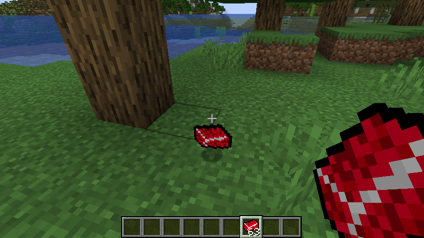

# Python-Inventory-Management-GUI
<h1>Minecraft Java Mod</h1>

<h2>Description</h2>
This was my first time using the Java coding language as well as creating a mod for the Java version of Minecraft. I added in a new simple item called "Solstheimite" which is a new mineral which I plan on soon making more adjustments to
the mod to make it more versatile like its counterparts. 
 

<h2>Languages and Utilities Used</h2>

- <b>Java</b> 
- <b>Gradle</b>
- <b>ParchmentMC</b>
- <b>Paint.net</b>
- <b>IntelliJ</b>

<h2>Environments Used </h2>

- <b>Windows 11</b> (21H2)
